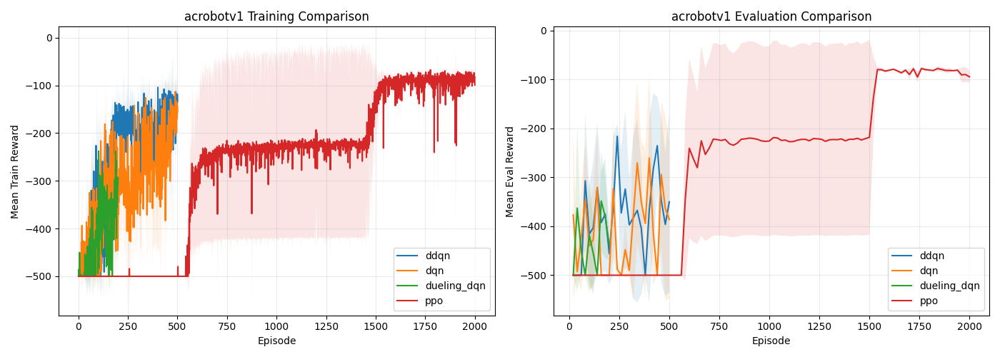
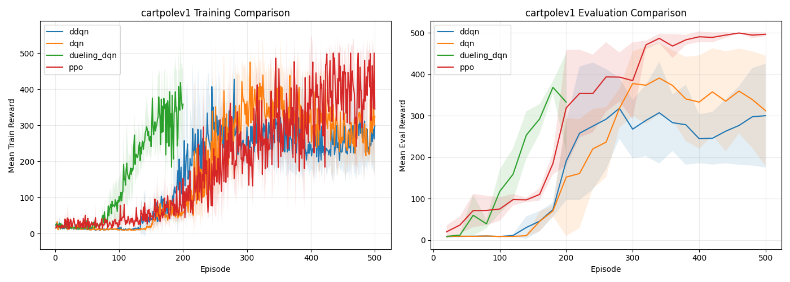
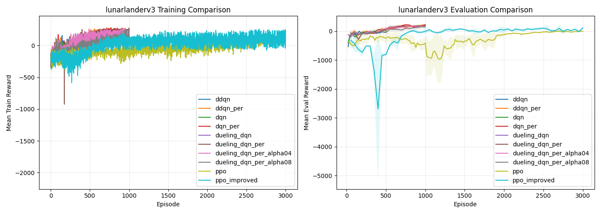
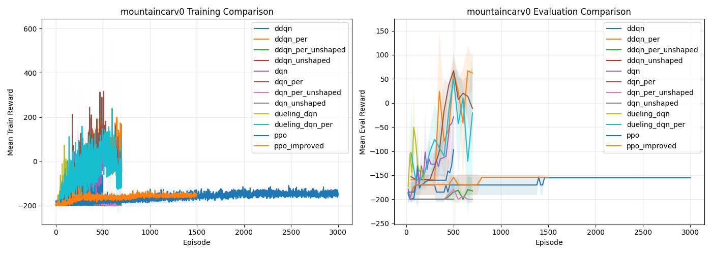

# Comparison Report

This file groups the main comparison plots and notes whether some experiments may still improve with more episodes.

## Combined Comparison Plots

### acrobotv1

| Algorithm | Mean Final Eval Reward | Std |
| --- | ---: | ---: |
| ppo | -94.60 | 12.55 |
| ddqn | -350.13 | 183.85 |
| dqn | -386.13 | 161.03 |
| dueling_dqn | -437.93 | 29.79 |

### cartpolev1

| Algorithm | Mean Final Eval Reward | Std |
| --- | ---: | ---: |
| ppo | 496.93 | 4.34 |
| dueling_dqn | 333.27 | 118.07 |
| dqn | 312.53 | 133.00 |
| ddqn | 300.60 | 125.26 |

### lunarlanderv3

| Algorithm | Mean Final Eval Reward | Std |
| --- | ---: | ---: |
| dueling_dqn_per | 224.28 | 22.43 |
| ddqn_per | 208.09 | 38.93 |
| dqn_per | 201.74 | 51.03 |
| dueling_dqn_per_alpha04 | 157.06 | 40.37 |
| dueling_dqn_per_alpha08 | 141.93 | 93.26 |
| ppo_improved | 113.29 | 21.04 |
| dqn | 13.48 | 36.09 |
| ppo | -7.54 | 8.88 |
| ddqn | -36.92 | 31.79 |
| dueling_dqn | -94.48 | 11.62 |

### mountaincarv0

| Algorithm | Mean Final Eval Reward | Std |
| --- | ---: | ---: |
| ddqn_per | 62.12 | 35.32 |
| dqn_per | -11.36 | 85.03 |
| dueling_dqn_per | -20.51 | 127.42 |
| dqn | -28.76 | 93.76 |
| ddqn | -96.95 | 89.70 |
| dueling_dqn | -142.08 | 16.03 |
| ppo_improved | -154.22 | 0.00 |
| ppo | -155.37 | 0.00 |
| ddqn_per_unshaped | -182.56 | 24.67 |
| ddqn_unshaped | -200.00 | 0.00 |
| dqn_per_unshaped | -200.00 | 0.00 |
| dqn_unshaped | -200.00 | 0.00 |

## Episode Extension Notes

| Environment | Algorithm | Last 5 Eval Points | Delta (first to last) | Delta (last step) | Verdict |
| --- | --- | --- | ---: | ---: | --- |
| acrobotv1 | ddqn | [-500.0, -363.4, -432.2, -500.0, -500.0] | 0.000 | 0.000 | mostly_plateaued |
| acrobotv1 | dqn | [-477.6, -500.0, -234.4, -494.4, -500.0] | -22.400 | -5.600 | unclear_or_unstable |
| acrobotv1 | dueling_dqn | [-500.0, -500.0, -240.0, -322.4, -452.6] | 47.400 | -130.200 | unclear_or_unstable |
| acrobotv1 | ppo | [-83.2, -82.2, -82.0, -80.6, -82.2] | 1.000 | -1.600 | mostly_plateaued |
| cartpolev1 | ddqn | [335.8, 372.2, 410.2, 463.6, 477.4] | 141.600 | 13.800 | likely_benefit |
| cartpolev1 | dqn | [500.0, 500.0, 500.0, 500.0, 500.0] | 0.000 | 0.000 | mostly_plateaued |
| cartpolev1 | dueling_dqn | [227.2, 232.0, 296.0, 377.4, 257.6] | 30.400 | -119.800 | unclear_or_unstable |
| cartpolev1 | ppo | [500.0, 500.0, 500.0, 500.0, 500.0] | 0.000 | 0.000 | mostly_plateaued |
| lunarlanderv3 | ddqn | [-34.1208, -19.8079, -30.6356, -57.9455, -78.9133] | -44.793 | -20.968 | unclear_or_unstable |
| lunarlanderv3 | ddqn_per | [201.8334, 160.3814, 107.7371, 225.5095, 173.4029] | -28.431 | -52.107 | unclear_or_unstable |
| lunarlanderv3 | dqn | [16.2484, 68.7517, 32.9508, 141.5859, 18.3285] | 2.080 | -123.257 | unclear_or_unstable |
| lunarlanderv3 | dqn_per | [167.833, 153.7792, 66.047, 191.5063, 212.0478] | 44.215 | 20.541 | likely_benefit |
| lunarlanderv3 | dueling_dqn | [-87.4331, -111.5959, -55.2152, -93.4909, -109.1075] | -21.674 | -15.617 | unclear_or_unstable |
| lunarlanderv3 | dueling_dqn_per | [168.0234, 168.4267, 177.0566, 182.3171, 234.9189] | 66.895 | 52.602 | likely_benefit |
| lunarlanderv3 | dueling_dqn_per_alpha04 | [149.1963, 165.4192, 101.9462, 158.6187, 110.4739] | -38.722 | -48.145 | unclear_or_unstable |
| lunarlanderv3 | dueling_dqn_per_alpha08 | [208.2222, 236.2841, 251.1814, 212.2007, 226.9526] | 18.730 | 14.752 | possible_benefit |
| lunarlanderv3 | ppo | [-10.1887, -0.0408, 1.2699, 40.0727, 4.7954] | 14.984 | -35.277 | unclear_or_unstable |
| lunarlanderv3 | ppo_improved | [61.6912, 46.7086, 57.1727, 65.8354, 141.9181] | 80.227 | 76.083 | likely_benefit |
| mountaincarv0 | ddqn | [-160.3789, -160.3789, -160.3789, -160.3789, -160.3789] | 0.000 | 0.000 | mostly_plateaued |
| mountaincarv0 | ddqn_per | [28.759, 32.291, 44.2157, 37.1318, 54.1299] | 25.371 | 16.998 | possible_benefit |
| mountaincarv0 | ddqn_per_unshaped | [-154.0, -144.3333, -200.0, -140.0, -147.6667] | 6.333 | -7.667 | unclear_or_unstable |
| mountaincarv0 | ddqn_unshaped | [-200.0, -200.0, -200.0, -200.0, -200.0] | 0.000 | 0.000 | mostly_plateaued |
| mountaincarv0 | dqn | [-118.4462, -72.5126, 12.095, 8.6721, 50.9537] | 169.400 | 42.282 | likely_benefit |
| mountaincarv0 | dqn_per | [41.7984, 40.1321, 36.6389, 35.1695, 48.8858] | 7.087 | 13.716 | possible_benefit |
| mountaincarv0 | dqn_per_unshaped | [-180.3333, -200.0, -200.0, -200.0, -200.0] | -19.667 | 0.000 | unclear_or_unstable |
| mountaincarv0 | dqn_unshaped | [-200.0, -200.0, -200.0, -200.0, -200.0] | 0.000 | 0.000 | mostly_plateaued |
| mountaincarv0 | dueling_dqn | [-94.7096, -144.3183, -129.9505, -160.3789, -144.5232] | -49.814 | 15.856 | unclear_or_unstable |
| mountaincarv0 | dueling_dqn_per | [72.2675, -200.0, -1.0282, -200.0, -200.0] | -272.267 | 0.000 | unclear_or_unstable |
| mountaincarv0 | ppo | [-155.3715, -155.3715, -155.3715, -155.3715, -155.3715] | 0.000 | 0.000 | mostly_plateaued |
| mountaincarv0 | ppo_improved | [-154.224, -154.224, -154.224, -154.224, -154.224] | 0.000 | 0.000 | mostly_plateaued |

## Quick Interpretation

- `likely_benefit`: the evaluation curve is still rising at the end, so more episodes may help.
- `possible_benefit`: there is some late-stage improvement, but evidence is weaker.
- `mostly_plateaued`: the last evaluations are nearly flat, so extra episodes are less likely to matter much.
- `unclear_or_unstable`: the ending curve is noisy or dropping, so simply increasing episodes may not be enough; tuning may be more useful.
